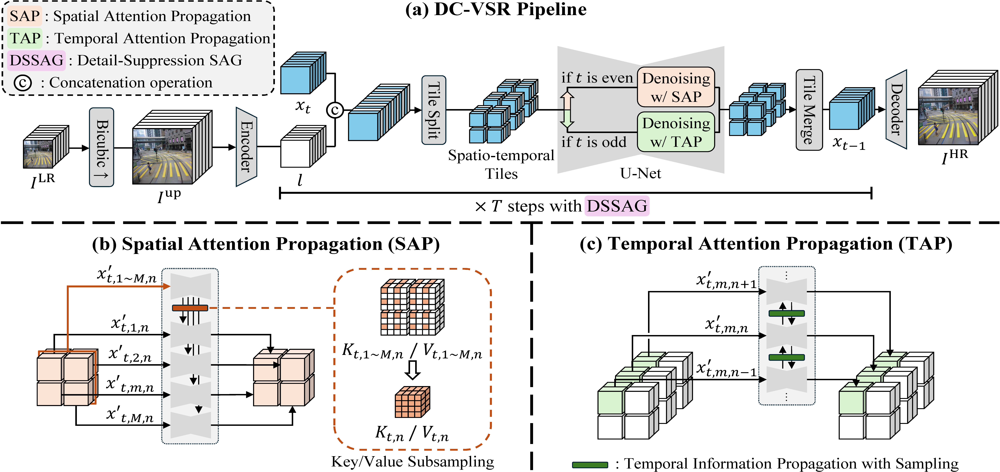

<!DOCTYPE html>
<html>
<head>
  <meta charset="utf-8">
  <meta name="description" content="DC-VSR: Spatially and Temporally Consistent Video Super-Resolution with Video Diffusion Prior">
  <meta name="keywords" content="Video Super-Resolution, Video Diffusion Prior, Diffusion Model">
  <meta name="viewport" content="width=device-width, initial-scale=1">
  <title>DC-VSR for video super-resolution</title>

  <link rel="icon" href="./assets/images/favicon.ico" type="image/x-icon">

  

  <link href="https://fonts.googleapis.com/css?family=Google+Sans|Noto+Sans|Castoro" rel="stylesheet">
  <link rel="stylesheet" href="./assets/css/bulma.min.css">
  <link rel="stylesheet" href="./assets/css/bulma-carousel.min.css">
  <link rel="stylesheet" href="./assets/css/bulma-slider.min.css">
  <link rel="stylesheet" href="./assets/css/fontawesome.all.min.css">
  <link rel="stylesheet" href="./assets/css/index.css">
  <link rel="stylesheet" href="https://cdn.jsdelivr.net/gh/jpswalsh/academicons@1/css/academicons.min.css">

  <!-- custom css file  -->
  <link rel="stylesheet" href="./assets/css/style.css">
  <link rel="stylesheet" href="./assets/css/twentytwenty.css">
  
</head>
<body>

  <section class="hero">
    

      

        

          

            <h1 class="beautiful-text main_title is-2 publication-title"> 
              DC-VSR
            </h1>
            <h1 class="title is-3 publication-title"> 
              Spatially and Temporally Consistent Video Super-Resolution with Video Diffusion Prior
            </h1>
  
            

              
                <a href="https://cg.postech.ac.kr/">Janghyeok Han1&#8224</a>&nbsp;&nbsp;
              
                <a href="https://cg.postech.ac.kr/">Gyujin Sim1&#8224</a>&nbsp;&nbsp;
              
                <a href="https://kimgeonung.github.io/">Geonung Kim1</a>&nbsp;&nbsp; 
              
                <a href="https://cg.postech.ac.kr/">Hyun-Seung Lee2</a>&nbsp;&nbsp; 
              
                <a href="https://cg.postech.ac.kr/">Kyuha Choi2</a>&nbsp;&nbsp; 
              
                <a href="https://cg.postech.ac.kr/">Youngseok Han2</a>&nbsp;&nbsp; 
              
                <a href="https://www.scho.pe.kr/">Sunghyun Cho1</a> 
            

            

              1POSTECH,&nbsp;&nbsp;2Visual Display Business, Samsung Electronics
            

          <!-- 

            ICCV 2023
          
 -->

          

            &#8224Equal contribution
          

          

            

              <!-- PDF Link. -->
              <!-- 
                <a href="./xx.pdf" target="_blank"
                   class="external-link button is-normal is-rounded is-dark">
                  
                      <i class="fas fa-file-pdf"></i>
                  
                  Paper
                </a>
               -->
              <!-- arXiv Link. -->
              
                <a href="https://arxiv.org/abs/2502.03502" target="_blank"
                   class="external-link button is-normal is-rounded is-dark">
                  
                      <i class="ai ai-arxiv"></i>
                  
                  arXiv
                </a>
              

              <!-- Code Link. -->
               
                <a href="https://github.com/DaramGC/DC-VSR/tree/main" target="_blank"
                   class="external-link button is-normal is-rounded is-dark">
                  
                      <i class="fab fa-github"></i>
                  
                  Code
                  </a>
              

              <!-- Video Link. -->
              
                <a href="https://www.youtube.com/watch?v=EaHrA9bcMSs" target="_blank"
                   class="external-link button is-normal is-rounded is-dark">
                  
                      <i class="fab fa-youtube"></i>
                  
                  Video
                </a>
              
            

          

        

      

    

  

</section>

<!-- teaser -->
<section class="hero is-light is-small">
  

    

      

        

          

            
Classic Animation Video

            

              <video muted autoplay="autoplay" loop="loop" width="100%">
                <source src="./assets/videos/_anime_00.mp4" type="video/mp4">
              </video> 
            

            

              <video muted autoplay="autoplay" loop="loop" width="100%">
                <source src="./assets/videos/_sr_anime_00.mp4" type="video/mp4">
              </video>
            

          

        

        

          

            
AIGC Video

            

              <video muted autoplay="autoplay" loop="loop" width="100%">
                <source src="./assets/videos/_12_speedup30fps.mp4" type="video/mp4">
              </video> 
            

            

              <video muted autoplay="autoplay" loop="loop" width="100%">
                <source src="./assets/videos/_sr_12.mp4" type="video/mp4">
              </video> 
            

          

        

        

          

            
Old Movie

            

              <video muted autoplay="autoplay" loop="loop" width="100%">
                <source src="./assets/videos/_002.mp4" type="video/mp4">
              </video> 
            

            

              <video muted autoplay="autoplay" loop="loop" width="100%">
                <source src="./assets/videos/_sr002.mp4" type="video/mp4">
              </video>
            

          

        

      

  

</section>

<!-- first row -->
<section class="hero is-light is-small">
  

    

      

        

          

            
Classic Animation Video

            

              <video muted autoplay="autoplay" loop="loop" width="100%">
                <source src="./assets/videos/_006.mp4" type="video/mp4">
              </video> 
            

            

              <video muted autoplay="autoplay" loop="loop" width="100%">
                <source src="./assets/videos/_sr006.mp4" type="video/mp4">
              </video>
            

          

        

        

          

            
AIGC Video

            

              <video muted autoplay="autoplay" loop="loop" width="100%">
                <source src="./assets/videos/_00_speedup30fps.mp4" type="video/mp4">
              </video> 
            

            

              <video muted autoplay="autoplay" loop="loop" width="100%">
                <source src="./assets/videos/_sr_00.mp4" type="video/mp4">
              </video> 
            

          

        

        

          

            
AIGC Video

            

              <video muted autoplay="autoplay" loop="loop" width="100%">
                <source src="./assets/videos/_13_speedup30fps.mp4" type="video/mp4">
              </video> 
            

            

              <video muted autoplay="autoplay" loop="loop" width="100%">
                <source src="./assets/videos/_sr_13.mp4" type="video/mp4">
              </video>
            

          

        

        

          

            
AIGC Video

            

              <video muted autoplay="autoplay" loop="loop" width="100%">
                <source src="./assets/videos/_14_speedup30fps.mp4" type="video/mp4">
              </video> 
            

            

              <video muted autoplay="autoplay" loop="loop" width="100%">
                <source src="./assets/videos/_sr_14.mp4" type="video/mp4">
              </video>
            

          

        

      

  

</section>

<!-- second row -->
<section class="hero is-light is-small">
  

    

      

        

          

            
VideoLQ

            

              <video muted autoplay="autoplay" loop="loop" width="100%">
                <source src="./assets/videos/_012.mp4" type="video/mp4">
              </video> 
            

            

              <video muted autoplay="autoplay" loop="loop" width="100%">
                <source src="./assets/videos/_sr012.mp4" type="video/mp4">
              </video> 
            

          

        

        

          

            
VideoLQ

            

              <video muted autoplay="autoplay" loop="loop" width="100%">
                <source src="./assets/videos/_014.mp4" type="video/mp4">
              </video> 
            

            

              <video muted autoplay="autoplay" loop="loop" width="100%">
                <source src="./assets/videos/_sr014.mp4" type="video/mp4">
              </video> 
            

          

        

        

          

            
VideoLQ

            

              <video muted autoplay="autoplay" loop="loop" width="100%">
                <source src="./assets/videos/_024.mp4" type="video/mp4">
              </video> 
            

            

              <video muted autoplay="autoplay" loop="loop" width="100%">
                <source src="./assets/videos/_sr024.mp4" type="video/mp4">
              </video> 
            

          

        

        

          

            
VideoLQ

            

              <video muted autoplay="autoplay" loop="loop" width="100%">
                <source src="./assets/videos/_026.mp4" type="video/mp4">
              </video> 
            

            

              <video muted autoplay="autoplay" loop="loop" width="100%">
                <source src="./assets/videos/_sr026.mp4" type="video/mp4">
              </video> 
            

          

        

        

          

            
VideoLQ

            

              <video muted autoplay="autoplay" loop="loop" width="100%">
                <source src="./assets/videos/_033.mp4" type="video/mp4">
              </video> 
            

            

              <video muted autoplay="autoplay" loop="loop" width="100%">
                <source src="./assets/videos/_sr033.mp4" type="video/mp4">
              </video> 
            

          

        

        

          

            
VideoLQ

            

              <video muted autoplay="autoplay" loop="loop" width="100%">
                <source src="./assets/videos/_036.mp4" type="video/mp4">
              </video> 
            

            

              <video muted autoplay="autoplay" loop="loop" width="100%">
                <source src="./assets/videos/_sr036.mp4" type="video/mp4">
              </video> 
            

          

        

      

  

</section>

<section class="teaser">
  

      

        <!-- 
 -->
        

          

              <b>DC-VSR</b> is video super-resolution model that breathes life into low-res footage with fine detail and clarity.
          

          

        

      

  

</section>

<section class="section">
  

    <!-- Abstract. -->
    

      

      <!-- 
 -->
        <h2 class="title is-3">Abstract</h2>
        

          

            Video super-resolution (VSR) aims to reconstruct a high-resolution (HR) video from a low-resolution (LR) counterpart. 
            Achieving successful VSR requires producing realistic HR details and ensuring both spatial and temporal consistency. 
            To restore realistic details, diffusion-based VSR approaches have recently been proposed. 
            However, the inherent randomness of diffusion, combined with their tile-based approach, often leads to spatio-temporal inconsistencies. 
            In this paper, we propose <b>DC-VSR</b>, a novel VSR approach to produce spatially and temporally consistent VSR results with realistic textures. 
            To achieve spatial and temporal consistency, <b>DC-VSR</b> adopts a novel <b>Spatial Attention Propagation (SAP)</b> scheme and a <b>Temporal Attention Propagation (TAP)</b> scheme that propagate information across spatio-temporal tiles based on the self-attention mechanism. 
            To enhance high-frequency details, we also introduce <b>Detail-Suppression Self-Attention Guidance (DSSAG)</b>, a novel diffusion guidance scheme. 
            Comprehensive experiments demonstrate that DC-VSR achieves spatially and temporally consistent, high-quality VSR results, outperforming previous approaches.
          

        

      

    

    <!--/ Abstract. -->
  

</section>

<section class="section">
  

    

      <!-- 
 -->
      

        <h2 class="title is-3">Method</h2>
        

          

            DC-VSR enhances low-resolution videos to any high-resolution videos.
            To deal with any size of videos, DC-VSR processes inputs with overlapping spatio-temporal tiles.
            However, tile-based approach has inconsistency problem among separated tiles.
            By employing Spatial Attention Propagation (SAP) and Temporal Attention Propagation (TAP), 
            the sharing of information among spatio-temporal tiles leads to spatially and temporally consistent high-resolution videos.
            Furthermore, to improve the video frame quality, latents in each diffusion timesteps go through Detail-Suppression Self-Attention Guidance (DSSAG).
            DSSAG leads model to generate fine detail and clear frames.
          

          

            
          

        

      

    

  

</section>

<!-- Paper video. -->

  

      

        <h2 class="title is-3">
          DC-VSR
          Video
        </h2>
        

          <iframe 
            src="https://www.youtube.com/embed/EaHrA9bcMSs?rel=0&showinfo=0" 
            frameborder="0" 
            allow="autoplay; encrypted-media" 
            allowfullscreen>
          </iframe>
        

    

  

<section class="section" id="BibTeX">
  

    <h2 class="title">BibTeX</h2>
    <pre><code>@InProceedings{janghyeok2025dcvsr,
      title     = {{DC-VSR}: Spatially and Temporally Consistent Video Super-Resolution with Video Diffusion Prior},
      author    = {Janghyeok, Han and Gyujin, Sim and Geonung, Kim and Hyun-Seung, Lee and Kyuha, Choi and Youngseok, Han and Sunghyun, Cho},
      journal   = {arXiv preprint arXiv:2502.03502},
      year      = {2025},
    }</code></pre>
  

</section>

<footer class="footer">
  

    

      <a class="icon-link" href="https://arxiv.org/abs/2502.03502" target="_blank">
        <i class="fas fa-file-pdf"></i>
      </a>
      <a class="icon-link" href="https://github.com/DaramGC/DC-VSR/tree/main" target="_blank">
        <i class="fab fa-github"></i>
      </a>
      <a class="icon-link" href="https://www.youtube.com/watch?v=EaHrA9bcMSs" target="_blank">
        <i class="fab fa-youtube"></i>
      </a>
    

    

      

        

          

            Thanks to <a href="https://github.com/nerfies/nerfies.github.io" target="_blank">Nerfies</a> and <a href="https://shangchenzhou.com/projects/upscale-a-video/" target="_blank">Upscale-A-Video</a> for the website template. Thank you very much!
          

        

      

    

  

</footer>

  <!-- custom js file  -->
  <!--  -->
  
  
  
  
  
  
</body>
</html>

